# Ledger

---
Ledger is a Command Line Application written in Java that provides basic accounting functions such as writing
credits/debits and reading from a .csv file to display data based on specific search criteria.

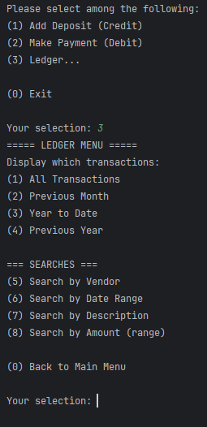

## Features

---

### Input

- Add Deposit - Prompts the user to provide details for a new _credit_ transaction to be added to the .csv file
- Make Payment - Prompts the user to provide details for a new _debit_ transaction to be added to the .csv file
### Reports
| Function                  | Description                                                                                                                                                                                                                  |
|---------------------------|------------------------------------------------------------------------------------------------------------------------------------------------------------------------------------------------------------------------------|
| **All Transactions**      | Displays all transactions                                                                                                                                                                                                    |
| **All Debits**            | Displays all debit (negative) transactions                                                                                                                                                                                   |
| **All Credits**           | Displays all credit (positive) transactions                                                                                                                                                                                  |
| **Search by Amount**      | Displays transactions according to user-specified minimum and maximum values **(Searches either credits or debits, but not both)**                                                                                           |
| **Search by Description** | Allows the user to enter text and returns transactions containing (will accept partial matches) that text. For example, entering "pay" will return transactions where the description is: "paycheck, paystub, payment, etc." |
| **Search by Vendor**      | Like "Search by Description", uses user input to find matching entries in the "vendor" column, will accept partial matches                                                                                                   |
| **Previous Month**        | Displays all credit and debit transactions for the previous month (based on the current date)                                                                                                                                |
| **Month to Date**         | Displays all credit and debit transactions for the current month so far                                                                                                                                                      |
| **Year to Date**          | Displays all credit and debit transactions for the current year so far                                                                                                                                                       |
| **Previous Year**         | Displays all credit and debit transactions for the previous year (based on the current date)                                                                                                                                 |

## Examples

---

Click on any of the functions below to see an image of how it works.

<details>
    <summary>Add Deposit</summary>

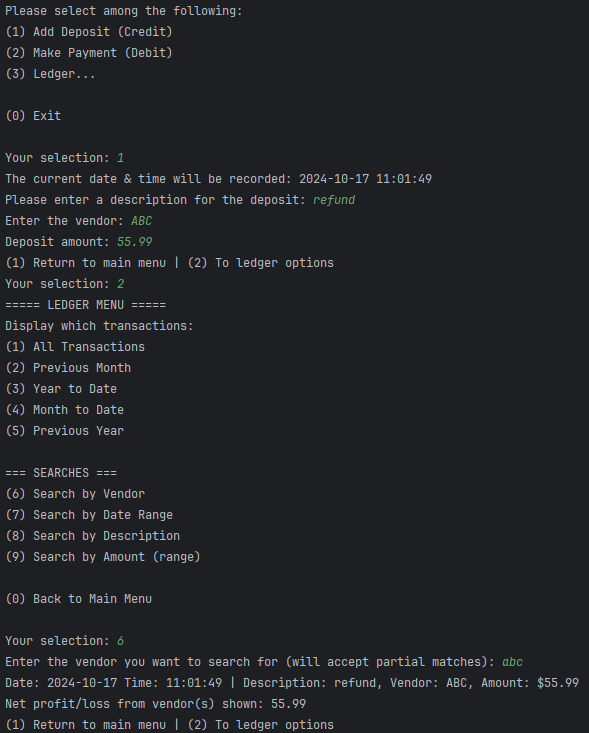
</details>

<details>
    <summary>Make Payment</summary>

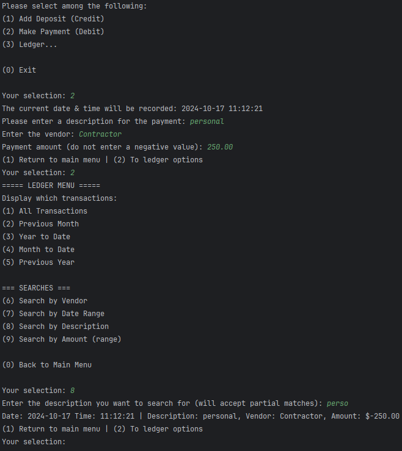
</details>

<details>
    <summary>All Transactions</summary>

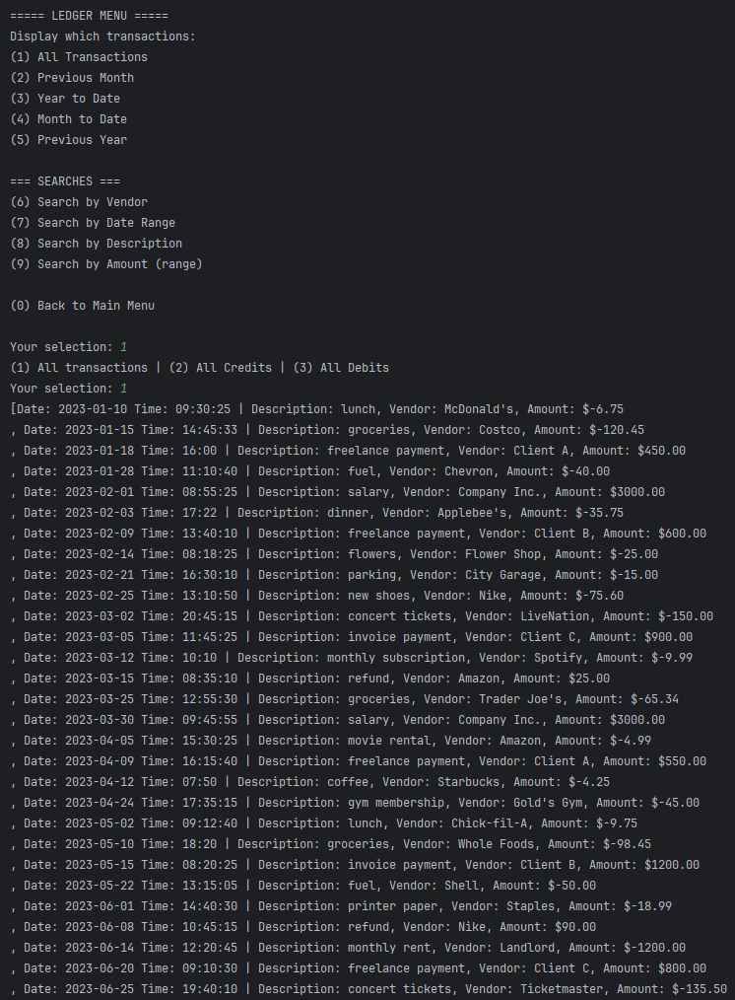
</details>

<details>
    <summary>All Debits</summary>

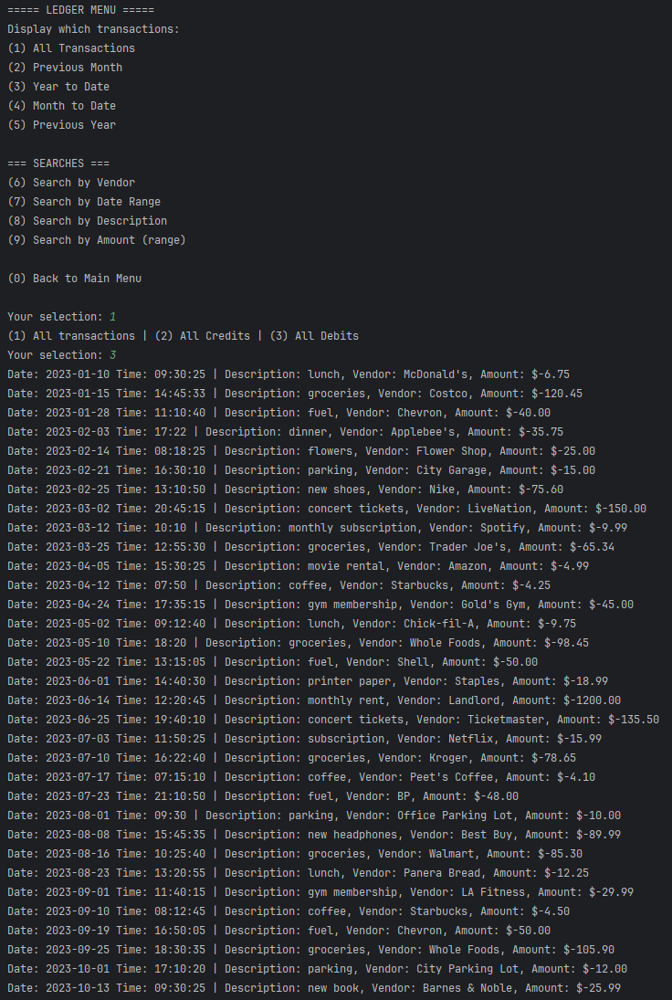
</details>

<details>
    <summary>All Credits</summary>

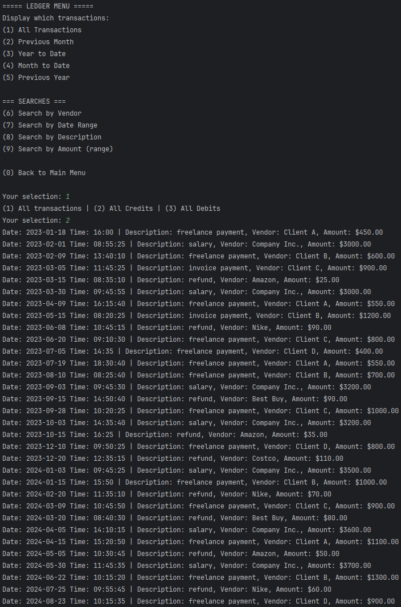
</details>

<details>
    <summary>Search by Amount</summary>

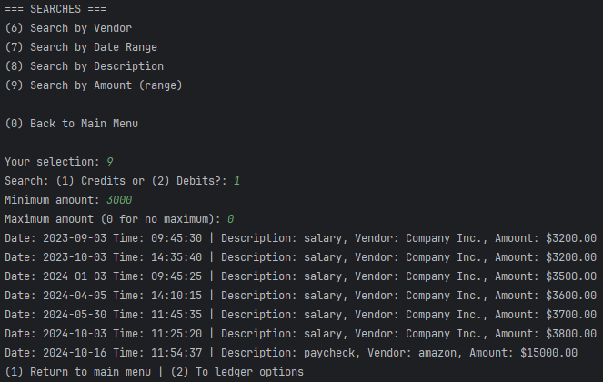
</details>

<details>
    <summary>Search by Description</summary>

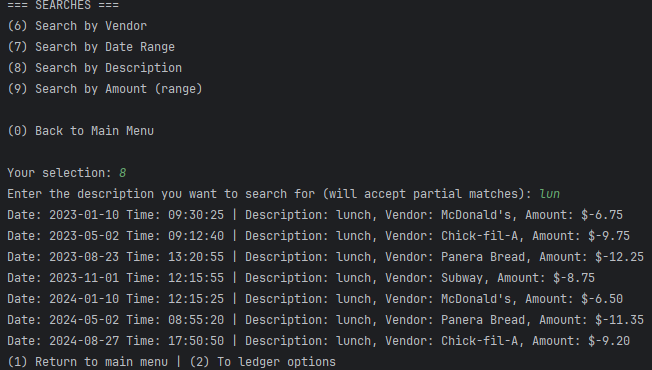
</details>

<details>
    <summary>Search by Vendor</summary>

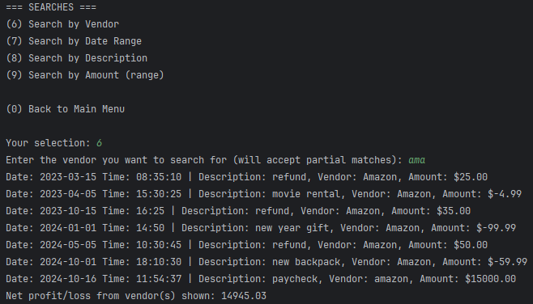
</details>

<details>
    <summary>Previous Month</summary>

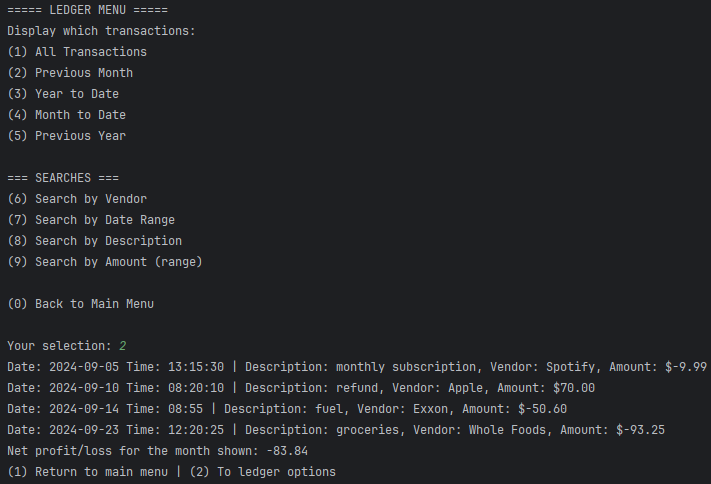
</details>

<details>
    <summary>Month to Date</summary>

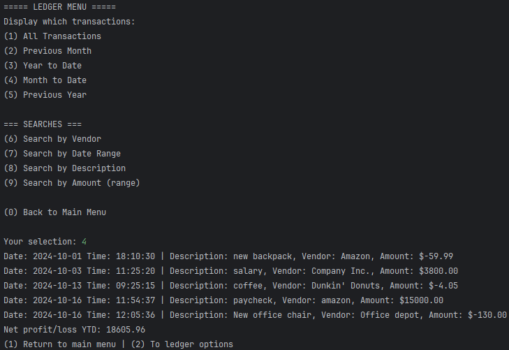
</details>

<details>
    <summary>Year to Date</summary>

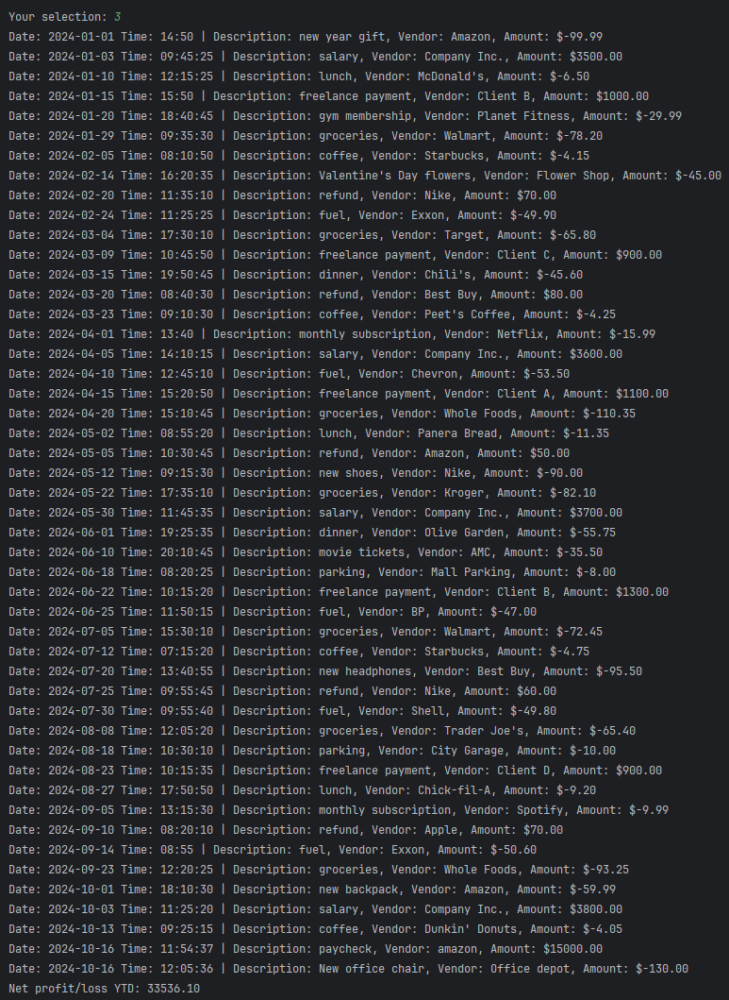
</details>

<details>
    <summary>Previous Year</summary>

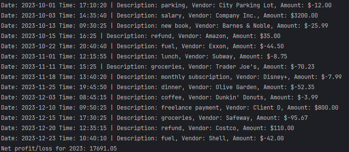
</details>

## Notable Mention

---
```
if(creditDebit == 1){
            byAmountCredit(min,max);
        } else {
            byAmountDebit(max,min); 
        }
```
 These lines of code simplified the process of dealing with the idea of min/max when it comes to negative values. For 
searching by amounts for only debits, max is passed as min as a parameter in my byAmountDebit() method (and vice versa for min),
allowing the same logic to be used (amount < max, amount > min)
## Notes

---

- Currently, the only exit point of the program is within the main menu
- No negative values should be used when prompted for input, doing so will cause an inaccurate entry (A debit showing up as a positive value)
- All String input is case-insensitive